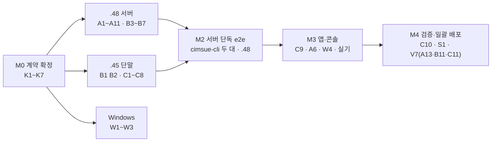

# MCVideo 개발 계획 — .48 · .45 두 호스트 분담 + Windows 관제 앱

> 설계 정본은 [../design/features/mcvideo.md](../design/features/mcvideo.md)(규격 모델·사용 시나리오·WP V0~V8·결정 D1~D9)다. 이 문서는 그 1차 범위를
> **두 개발 호스트(.48 서버 · .45 단말)와 Windows PC(관제 앱)** 가 나눠 병렬로 개발하기 위한 분담·순서·먼저 합의할 계약·완료 기준을 정한다.
> 일정 숫자는 추정이다(전일 투입, 규격 숙지 기준).

**확정 결정** — D5 기본 호 종류 = **chat** · D6 = 음성 호와 영상 호 **둘 다 유지**, 소리가 겹치면 영상 호 송출 음성 우선 · D9 = **전환 기간 없음**
(검증 뒤 서버와 APK 를 한 번에 배포하고 같은 창에서 현행 PTT 영상을 걷는다).

## 1. 1차 범위

- **포함** — V0~V7: 설정 평면(그룹 문서 두 서비스·MCVideo 속성·user profile·service config·ue-init-config·scope), CSP MCVideo 호 제어(등록 태그·서비스 인가·
  서비스별 affiliation·chat/prearranged 그룹 호), CMP 송출·수신 제어(TS 24.581 MCV0/1/2·동시 송출 상한·수신 manual), 단말 SDK·바인딩·cimsue-cli,
  PTT 앱 [영상 참여]·[영상 보내기]·[받기], 검증 게이트, **현행 PTT 영상 제거(V7 — 1차 배포와 같은 창)**. 사용 시나리오 = mcvideo.md §1.7 의
  «현장 영상 공유»·«여러 카메라 동시 송출».
- **제외(V8 백로그, §8)** — 긴급·임박·경보, 방송, 1:1, pull·push, ambient viewing, 원격 송출 요청, 송출 큐, ad hoc, pre-established, E2E, MBMS·off-network.
- **단말 1차 제약** — PTT 앱은 수신 스트림 **1개**(user profile `MaxSimultaneousVideoStreams` = 1)로 시작한다. 한 `m=video` 에 여러 SSRC 를 받아 나눠 그리려면
  엔진 확장이 필요하다(§7 R1).

## 2. 분담 — 호스트 셋

작업 분류는 트랙 셋(A 제어·설정 / B 미디어 / C 단말)이고, 트랙을 호스트에 이렇게 싣는다.

| 호스트 | 맡는 트랙 | 이 호스트가 알맞은 이유 | 소유 경로(주 편집자) |
|---|---|---|---|
| **.48 — 서버** | **A 전부** + **B3~B11**(CMP 그룹·상태 머신·RTCP·SRTP·녹취·자원) | 소스 서버·테스트베드 — CSP·CMP·CSC 를 마음대로 올리고 내린다. 계측기(팀원 트랙)와 함께 있다 | `csc/src/`, `sql/`, `csp/`, `ext/psip/`, `cmp/`, `ems/*/console`(그룹 편집·가입자), `ems/core/oam`(녹취·색인·통계 축), `docs/api/cmp_media_api.md` |
| **.45 — 단말** | **C 전부** + **K5·B1·B2**(TS 24.581 정의 테이블·생성기·양 끝 코덱) | Android 빌드 환경(build-native·gradle)·사내 단말 MF52·W999(adb)가 여기 있다. 라이브 서버라 CSP·CMP 개발 배포는 하지 않는다 | `sdk/core/`, `sdk/android/`, `sdk/windows/dotnet/`(코드), `android/ptt-client/`, `sdk/core/cli/`, 정의 테이블·`scripts/gen_mcvideo_tc_defs.py`, CMP `PTransmissionCodec`(코덱만), verify S3 MCVideo 항목 |
| **Windows PC — 관제 앱** | 관제 앱 두 벌의 MCVideo 몫 + .NET 빌드·시험 | WPF·.NET·MSVC 빌드 환경 | `windows/dispatch-desktop/`, `sdk/windows`(빌드), `docs/design/features/dispatch_desktop_ui.md` — 착수 목록 = [dispatch_windows_next.md](dispatch_windows_next.md) |

- 전송 제어의 양 끝 코덱(CMP·SDK)을 .45 가 한 정의 테이블에서 함께 만들고, .48 은 그 코덱 위에 CMP 서버 상태 머신을 얹는다 — .48 의 서버 몫이 커서 코덱을 덜어 낸 것이다.
- 양 끝 코덱 생성물과 단위시험은 .48 이 리뷰한다(교차 검토).
- 계측기(libcsim·시나리오)는 팀원 트랙 — .48 이 요구서를 넘긴다(B10).

## 3. 먼저 합의할 계약 — M0

병렬 작업의 조건은 **경계에서 쓰는 모양을 먼저 고정**하는 것이다. M0 산출은 한 커밋으로 묶고 두 호스트가 리뷰한다(K7 은 Windows PC 도).

| # | 계약 | 소유 · 리뷰 | 형태 | 쓰는 쪽 |
|---|---|---|---|---|
| K1 | DB 스키마 — `mcvideo_group_attrs`·`mcvideo_user_profile`·`mcvideo_affiliations` (추가 표만 — 공유 DB 에서 옛 코드 무영향) | .48 · .45 | `sql/migrate_mcvideo.sql` 초안 + `docs/design/db_schema.md` | CSC·CSP |
| K2 | 설정 문서 골든 샘플 — MCPTT+MCVideo 그룹 문서, MCVideo user profile, service config, ue-init-config `MCVideo-Service-Details` | .48 · .45 | `tests/fixtures/mcvideo/*.xml` (TS 24.481·24.484 스키마 검증) | CSC 생성 시험 · SDK 해석 시험 |
| K3 | SIP 계약 — REGISTER Contact 태그, chat 개시·합류·재합류 INVITE·200 의 헤더(Accept-Contact·P-Preferred-Service·Request-URI = PSI)와 mcvideo-info 본문, 거절 응답(404 + Warning 117·118 등) | .48 · .45 | `tests/fixtures/mcvideo/sip/*.txt` 골든 메시지 | CSP 해석·생성 · SDK 생성·해석 |
| K4 | SDP 프로파일 — offer/answer 전체 예(`m=audio`·`m=video`·`m=application … udp MCVideo` + fmtp), 포트·PT 규칙 | .48 · .45 | mcvideo.md §1.4 보강 + 골든 SDP | CSP(psip) · CMP 포트 · SDK |
| K5 | 전송 제어 정의 테이블 — 메시지 이름·RTCP APP 이름·subtype·필드 ID·원인 코드·타이머/카운터 기본값(TS 24.581 §9·§11) | .45 · .48 | `docs/design/features/mcvideo_tc_defs.yaml` + `scripts/gen_mcvideo_tc_defs.py`(CMP·SDK 헤더 생성, `--check` = S1 게이트 — floor 정의의 `gen_floor_defs.py` 와 같은 방식) | CMP · SDK |
| K6 | CSP↔CMP 제어 API — PTT_GROUP_ADD/JOIN/LEAVE 에 `service: "mcvideo"`, 멤버 포트 audio·video·control, 송출 제어 파라미터(최대 동시 송출·우선순위·타이머), CMP→CSP 이벤트(송출 시작·종료 — 로그·색인용), SSRC 규칙(§7 R2) | .48 · .45 | `docs/api/cmp_media_api.md` 새 절 | CSP `CmpClient` · CMP |
| K7 | SDK 공개 API 선언 — `AccountConfig.mcvideoServerUri`·`mcvideoEnabled`, `affiliate(…, service)`, `joinVideoGroupCall`, `requestTransmission`·`releaseTransmission`, `acceptReception`·`endReception`, `onTransmission`·`onReception`, `CallInfo.service` | .45 · .48 · Windows | `sdk/core/include/cimsue/*.h` 선언만(구현은 실패 반환) | PTT 앱 · 관제 앱 · 바인딩 |

- 계약을 바꿀 때는 소유 호스트가 문서·fixture·yaml 을 먼저 고치고 알린다. 다른 호스트는 **같은 커밋 창**에서 따라간다.
- K2·K3 fixture 는 양쪽 단위시험이 **같은 파일**을 읽는다 — 생성 쪽은 «이 파일과 같게», 해석 쪽은 «이 파일을 읽어 이 값» 으로 시험한다.

## 4. 작업 목록

규모: S = 1주 이하, M = 1~2주, L = 2~4주(추정). «선행» 이 비어 있으면 M0 뒤 바로 착수.

### .48 — 트랙 A 제어·설정

| ID | 작업 | 선행 | 규모 | 완료 기준 |
|---|---|---|---|---|
| A1 | V0 — MCPTT `<service enabler>` = MCPTT ICSI (CSC `get_group_xml`·`parse_group_document_xml`) | — | S | `S1-UNIT-CSC`, 옛 앱이 그룹 문서를 그대로 읽음 |
| A2 | DB 마이그레이션 적용 경로 + `video_enabled`=1 그룹 → MCVideo 지원 행 · CSP `DbManager`·`CspPttGroup` 적재 | K1 | M | 공유 DB 에 추가 표만, 옛 CSP·CSC 무영향 |
| A3 | 그룹 문서 MCVideo `<service>`·`<mcvideo-*>`·`<mcvideo-mcvideo-id>`(보호 false 명시) + XCAP PUT 해석 | K1 K2 | M | K2 fixture 와 일치, 스키마 검증 |
| A4 | CMS `org.3gpp.mcvideo.user-profile`·`org.3gpp.mcvideo.service-config` 라우트·생성 + xcap-diff | K1 K2 | M | K2 일치, `require_scope` |
| A5 | ue-init-config `MCVideo-Service-Details` · scope `3gpp:mc:video_*` 넷 · 리소스 서버 검사 | K2 | S | 토큰 scope = 요청 ∩ 카탈로그 |
| A6 | 관리 API·콘솔 — 그룹 편집 «서비스» 절(MCPTT·MCVideo·속성), 가입자 MCVideo 자격 | A2 | M | 콘솔 lint/typecheck, CSC 통지로 CSP 반영 |
| A7 | `CMcVideoAsModule` + `Setup.Roles.MCVIDEO`(기본 off) + ICSI 분기(`EventIncomingCall`) | K3 | S | MCPTT 호 회귀 무변화 |
| A8 | 등록 — Contact MCVideo 태그 기록, mcvideo-info 토큰 / poc-settings PUBLISH 서비스 인가 | K3 A7 | M | K3 골든 REGISTER 로 인가 |
| A9 | 서비스별 affiliation(`mcvideoPresInfo` NOTIFY) + chat 합류 암묵적 affiliation | A2 A8 | M | MCPTT affiliation 무변화 |
| A10 | `McVideoCallService` — chat·prearranged 개시·합류·재합류·퇴장·해제(T1·최대 시간), 그룹 종류 검사 404 117·118, mcvideo-info 코덱, Warning | A7 A9 K3 | L | K3 골든 전부, `S1-UNIT-CSP` |
| A11 | SDP — psip 합성 SDP 에 제어 채널 `udp MCVideo`·fmtp, `CmpClient` MCVideo 명령(K6) | K4 K6 B3 | M | 골든 SDP, CMP 와 합류 |
| A12 | 로그·CDR·통계 서비스 축 `mcvideo`(CSP `CallDir` → OAM) | A10 | M | `S1-UNIT-OAM-STATS` |
| A13 | V7 서버 몫 — CSP 가 MCPTT 세션 `m=video` 를 port 0 으로 거절, 그룹 문서 `<mcpttgi:mcptt-video>`·`X-Video-Port` 제거, 콘솔 «영상» 토글 → MCVideo 서비스 켜기 | A3 A6 | M | MCPTT 오퍼 `m=video` → port 0 answer |

### .48 — 트랙 B 미디어 (B3~B11)

| ID | 작업 | 선행 | 규모 | 완료 기준 |
|---|---|---|---|---|
| B3 | MCVideo 그룹 종류 + 멤버 단위(audio·video·control) + PTT_GROUP_ADD/JOIN `service: mcvideo` 해석(K6) | K6 | M | `tests/cmp_smoke_mcvideo_*.py` 로 포트 할당 |
| B4 | 송출 제어 서버 — §6.3.4·§6.3.5 상태 머신, 최대 동시 송출, 우선순위 revoke, T1~T4 | B2 B3 | L | 상태 전이 단위시험(허가·거절·회수·종료·유휴) |
| B5 | 수신 제어 — §6.3.6·§6.3.7, 수신자별 Active SSRC List 분배, manual 모드, T5·T6·T11 | B4 | L | [받기] 전 영상 RTP 0, 뒤 도달 |
| B6 | 영상 RTCP 소켓 + PLI·FIR 를 송출자에게 | B3 | M | 수신자 PLI → 송출자 도달 |
| B7 | 영상 SRTP(`media_crypto_video` JOIN) + 제어 SRTCP(`PFloorCrypto` 재사용) | B3 | S | SAVP leg 영상 암호문 |
| B8 | 녹취 — 송출마다 슬롯 트랙(audio·video), 색인 서비스 축 `mcvideo` | B4 | M | 녹취 재생에 MCVideo 세션 |
| B9 | HEARTBEAT 자원·통계 | B3 | S | CSP 가 자원 부족을 안다 |
| B10 | 계측기 요구서(libcsim MCVideo 단말·시나리오 셋, `PTT-GROUP-CALL-VIDEO`·`S6-SCN-PTT-VIDEO` 대체) — 팀원 트랙에 전달 | B5 | S | 요구서 합의 |
| B11 | V7 CMP 몫 — MCPTT 그룹의 PTT 영상 분배 경로 제거 | A13 | S | PTT 회귀 무변화 |

### .45 — 트랙 C 단말 + 전송 제어 코덱 (K5·B1·B2)

| ID | 작업 | 선행 | 규모 | 완료 기준 |
|---|---|---|---|---|
| B1 | K5 정의 테이블 + 생성기 + `--check` 게이트 | — | S | S1 게이트 등록 |
| B2 | `PTransmissionCodec`(CMP) + SDK 코덱 — MCV0/1/2 부호화·해석(필드 표 §9.2.3), 서로의 출력을 읽는 교차 시험 | B1 | M | 생성 상수 사용, 양 끝 왕복 단위시험 |
| C1 | V0 — SDK `GroupDoc` 생성 enabler = MCPTT ICSI | — | S | `S1-UE-UNIT` |
| C2 | 설정 해석 — `UeInitConfigDoc.mcvideoServerUri`, `GroupDoc` MCVideo 서비스·속성, MCVideo user profile·service config | K2 | M | K2 fixture 해석 |
| C3 | 등록 태그·서비스 인가 본문, `affiliate(…, service)` | K3 K7 | M | K3 골든과 일치 |
| C4 | MCVideo 그룹 호 — `joinVideoGroupCall`(chat·prearranged), SDP 3 m-line, mcvideo-info 코덱, 퇴장 | K3 K4 C3 | L | 루프백 가짜 서버 시험(`mcptt_condition_test.cpp` 방식) |
| C5 | 송출 참여자(§6.2.4, T100·T101) · 수신 참여자(§6.2.5, T103·T104) — K5 생성 상수, 이벤트 | K5 C4 | L | 상태 전이 단위시험 |
| C6 | 영상 송출·렌더를 MCVideo 호에 결선(허가 = 송출, [받기] = 렌더) — 1차 수신 스트림 1개 | C5 | M | 영상 호 1개 송수신 |
| C7 | 바인딩 — C API·.NET·Kotlin 코드(현행 그룹 영상 옵션 누락도 메움) — .NET 빌드·시험은 Windows PC | C4 C5 | M | `S1-UE-ANDROID-BIND`, Windows 에서 `CimsUe.Tests` |
| C8 | cimsue-cli `video-call <g> [--transmit-at S] [--accept]` + drive 명령 | C5 | S | M2 통합 시험 구동 |
| C9 | PTT 앱 — [영상 참여/나가기]·[영상 보내기]·«새 영상» [받기], [PTT]·하드웨어 PTT 키 = 음성 호(D6), 두 호 소리가 겹치면 영상 호 우선 | C7 | M | 실기 MF52·W999 |
| C10 | verify S3 — `S3-SCN-MCVIDEO-CHAT`·`-TRANSMIT`·`-RECEPTION`·`-MAX-TX`(cimsue-cli 두 대, 대상 .48) | C8 M2 | M | cims-verify 등록 |
| C11 | V7 단말 몫 — PTT 앱·SDK 가 MCPTT 호에 영상을 제안하지 않는다(`GroupCallOptions.video` 제거, 현행 PTT 영상 UI 를 MCVideo 호로) | C9 | S | MCPTT 오퍼에 `m=video` 없음 |

### Windows PC — 관제 앱

| ID | 작업 | 선행 | 규모 | 완료 기준 |
|---|---|---|---|---|
| W1~W3 | 내일 오전 착수분 — SDK 변경분 Windows 빌드·시험, 긴급·경보 서버 반영 짝, MCVideo 관제 화면 설계 초안 | — | S~M | [dispatch_windows_next.md](dispatch_windows_next.md) |
| W4 | 그룹 편집 «영상» 토글 → MCVideo 서비스 켜기(데스크톱·태블릿) | A3 C2 | S | V7 과 같은 창 |
| W5 | 관제 앱 MCVideo — [영상 참여]·[영상 보내기]·[받기] (1차 = 수신 1개) | C7 | M | 실기 |
| W6 | 다중 스트림 수신 격자 | R1 | L | V8 |

## 5. 마일스톤

| 마일스톤 | 내용 | 참여 | 추정 |
|---|---|---|---|
| **M0** 계약 확정 | K1~K7 한 커밋, V0(A1·C1) 동시 | .48 · .45 (K7 리뷰 Windows) | 1~2주 |
| **M1** 부품 완성 | 호스트별 단위시험 green — .48: A2~A10·B3~B5 · .45: B1·B2·C2~C5 | 호스트별 | 5~6주 |
| **M2** 서버 단독 e2e | A11·B6·B7·C6·C8 로 cimsue-cli 두 대(.48 대상): chat 합류 → 송출 허가 → [받기] 전후 영상 → 상한 초과 거절 → 퇴장 뒤 MCPTT 호 무영향. .48 준비 = [mcvideo_m2_runbook.md](mcvideo_m2_runbook.md) | .48 · .45 | 2주 |
| **M3** 앱·콘솔 | C9 PTT 앱 · A6 콘솔 · W4 관제 앱 토글 · 사내 단말 실기 · B8 녹취 · A12 통계 | 전원 | 3주 |
| **M4** 검증·일괄 배포 | C10 S3 등록 · S1 전 항목 · .48 실측 → V7(A13·B11·C11) 포함 서버·APK 한 창 배포(.45 는 사용자 go) | 전원 | 1주 |
| 합계(1차) | | | **≈ 12~14주** |

- **임계 경로** — K3·K4·K6 → A10·A11 / B3·B4·B5 / C4·C5 → M2.
- **M2 전 대역** — .48: CMP 없이 `CmpClient` 명령을 fixture 로 대조, B3 뒤엔 실제 CMP, CMP 는 CSP 없이 UDP JSON 명령 직접(`tests/cmp_smoke_*.py` 방식) + RTCP APP 시험 송신기 ·
  .45: 루프백 가짜 서버(SIP)와 K5 생성 상수로 참여자 상태 머신 시험.

## 6. 협업 규칙

- **공유 트리** — 두 호스트 모두 `main` 에 직접 커밋·푸시(현행 관례). 작업 전 `git pull --ff-only`, 자기 소유 경로만 `git add`(`commit -a` 금지), 트랙 파트가 S1 green 일 때 커밋.
  동작·인터페이스·설정 키를 바꾸면 해당 문서를 같은 커밋에서 갱신한다(CLAUDE.md).
- **공유 파일** — mcvideo.md, `cmp_media_api.md`, `db_schema.md`, K 계약물은 소유 호스트 외 편집 시 소유 호스트 확인.
- **호스트 간 인계** — 서버(.48) → 단말(.45) 짝과 그 결과는 [server45_handoff.md](server45_handoff.md) 형식으로 주고받는다(MCVideo 절을 새로 연다). Windows PC 몫은
  [dispatch_windows_next.md](dispatch_windows_next.md).
- **배포** — 개발·실측은 .48 테스트베드(역할 `Setup.Roles.MCVIDEO` on). **.45 는 라이브(협력업체 단말)** 라 개발 중 CSP·CMP 를 올리지 않는다 — M4 일괄 배포만, 사용자 go 와 시각 지정 뒤.
- **공유 DB** — .45·.48·.135 공용. 1차 마이그레이션은 **표 추가만**(옛 코드 무영향), `video_enabled` 열 DROP 은 전 사이트가 새 빌드가 된 뒤(mcvideo.md §8).
- **주간 통합** — 매주 한 번 두 호스트의 main 을 .48 에 올려 M2 시나리오를 되는 데까지 돌린다.

## 7. 위험

| # | 위험 | 영향 | 대응 |
|---|---|---|---|
| R1 | **한 `m=video` 에 여러 송출자(SSRC)** — 규격은 수신자에게 허가된 송출을 SSRC 로 구분해 보낸다. pjmedia 스트림은 m-line 하나에 원격 스트림 하나를 다룬다 | 단말 다중 영상·다중 음성 수신 불가 | 1차 = 수신 스트림 1개(`MaxSimultaneousVideoStreams` 1). 다중 수신은 엔진 확장 — 동시 발언 미디어 과제([mcptt_ue_multitalker_media.md](../design/features/mcptt_ue_multitalker_media.md) U10)와 한 작업으로 V8 |
| R2 | 참여·제어 기능 겸임 CIMS 에서 SSRC 재작성 규칙(TS 24.581 §6.4.2) — 송출자 SSRC 를 그대로 둘지, CMP 가 송출마다 SSRC 를 줄지 | 단말 상태 머신·녹취 | K6 에서 결정(권고: 허가 때 CMP 가 준 Audio·Video SSRC 를 Granted·Notification 에 싣고 그대로 전달) |
| R3 | psip 합성 SDP 확장(세 m-line, 제어 채널 이름 서비스별) | MCPTT SDP 회귀 | `S1-UNIT-PSIP` 에 MCPTT·MCVideo 골든 SDP 둘 다 |
| R4 | 규격 원문 불일치(mcvideo.md §9) | 해석 차이 | K3·K4·K5 에 따를 쪽을 적어 고정 |
| R5 | .48 서버 몫이 크다(A 전부 + B 대부분) | 일정 | 코덱(B1·B2)을 .45 로 덜어 냄, M1 을 5~6주로 잡음 |
| R6 | 전환 기간 없음(D9) — 배포 순간 옛 APK 의 PTT 영상이 꺼진다 | 협력업체 단말 영상 중단 | M4 에서 서버·APK 한 창, APK 배포 목록(사내·협력업체) 사전 확인. 음성 무전은 그대로 |
| R7 | 관제 앱 다중 스트림 화면(Windows) | 관제 시나리오 지연 | 1차 완료는 PTT 앱 시나리오로 판정, 관제 앱 다중 스트림은 R1 뒤(W6) |

## 8. 후속 백로그(V8) — 호스트 배정 제안

| 항목 | .48 서버 | .45 단말 | Windows 관제 앱 |
|---|---|---|---|
| 긴급·임박·경보 영상 호 | 조건 상향·해제·경보 MESSAGE, automatic 수신·우선순위 | SOS 결선 | 긴급 배너·자동 표시 |
| 방송 영상 호 | 개시자 한정·송출 고정 | UI | 지휘관 송출 |
| 1:1 영상(전송 제어 유무) | private 호·1:1 제어 | UI | UI |
| video pull · push · 서버 저장/재생 | 호 절차·URL·서버 원천·저장 | UI | 영상 가져오기·저장 영상 보기 |
| ambient viewing · 원격 송출 · 그룹에 원격 영상 | 인가·PSI·Remote Transmission | 무표시 자동 수락 | 원격 영상 보기·송출 요청 |
| 다중 스트림 수신(R1) | 스트림별 분배 | 엔진 SSRC 분리·스트림별 렌더 | 스트림 격자(W6) |
| 송출 큐 · 화질 조정 · ad hoc | 그룹 속성·절차·큐 | UI | UI |
| E2E(보호 true) | GMK·암호문 전달 | 키 | 키 |

## 9. 1차 완료 기준

- mcvideo.md §10 의 V0·V1·V2·V3·V5·V7 기준 전부.
- S1 — `S1-UNIT-CSC`·`S1-UNIT-CSP`·`S1-UNIT-CMP`·`S1-UNIT-PSIP`·`S1-UE-UNIT`·`S1-UE-ANDROID-BIND`·전송 제어 정의 `--check` green, Windows `CimsUe.Tests`.
- S3 — `S3-SCN-MCVIDEO-*` 넷 PASS(.48), 기존 PTT·MCData·VoLTE 회귀 무변화.
- 실기 — 사내 단말 두 대로 «현장 영상 공유»를 끝까지(음성 무전 유지 포함).
